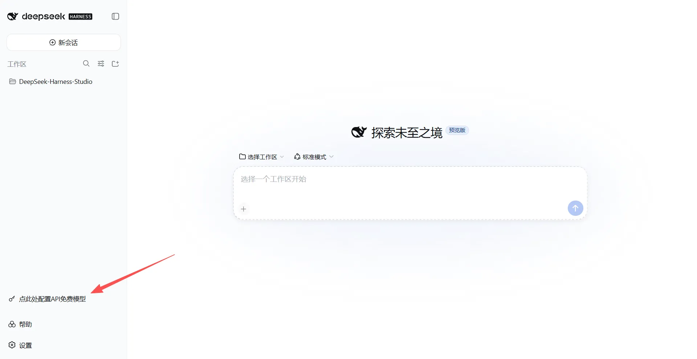
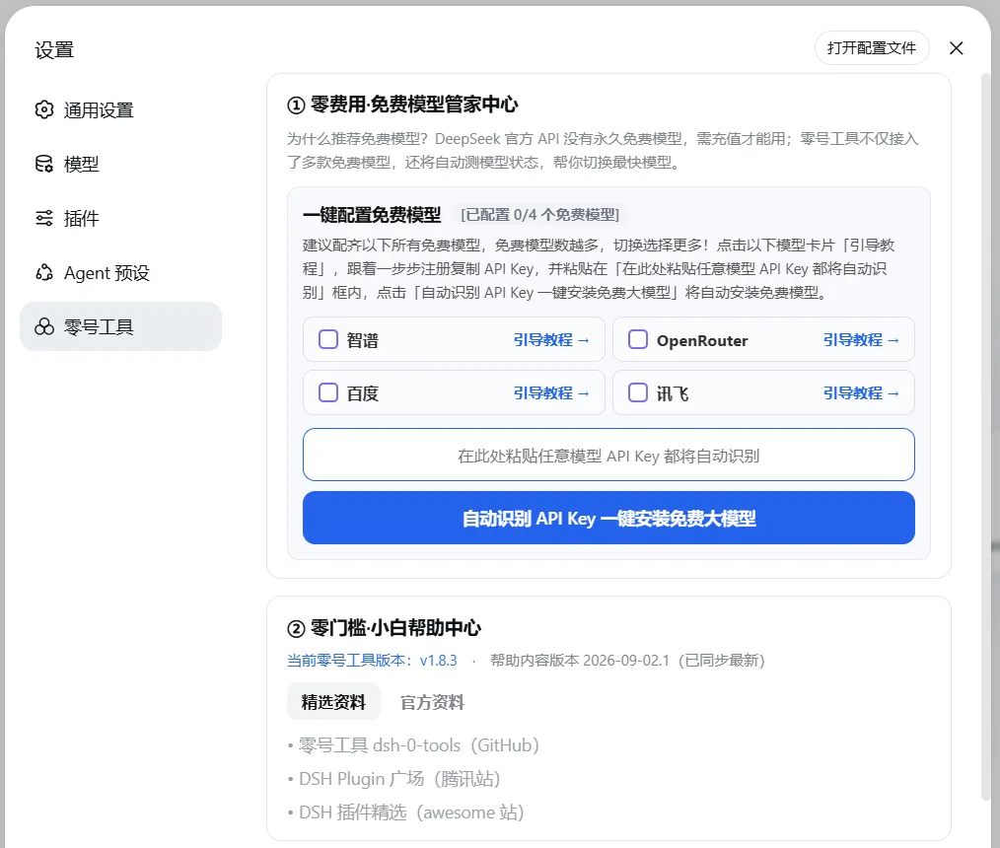
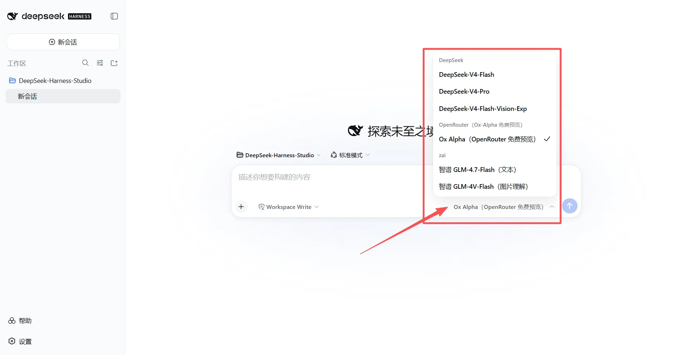
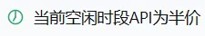

# dsh-0-tools 零号工具（No.0 Tools）

[简体中文](./README.md) · [English](./README.en.md)

## 零号工具是什么

零号工具是面向编程零基础的用户、初次使用 DeepSeek Harness（以下简称 DSH）场景而设计的工具，具有「零门槛、零费用、零失控」的特性，希望帮助零基础用户获得更好的使用体验。

## 主要功能

1. <strong>【零门槛】</strong>一键安装 DSH 及本工具；
2. <strong>【零费用】</strong>一键为 DSH 安装配置可免费调用 API 的大模型（目前提供智谱 GLM）；
3. <strong>【零失控】</strong>若选择调用 DeepSeek 模型 API，将在 DSH 的界面实时提示 API 费用是原价还是半价；
4. <strong>【零门槛】</strong>为了让新手更快学习掌握 DSH，在帮助中心提供了靠谱信源的相关资讯。

## 当前版本与兼容范围

- 当前版本：**v1.4.0**
- 兼容 DSH 版本：`0.1.0-rc.7` ～ `0.1.1-rc.2`
- **系统要求**：仅支持 **Windows 10 / Windows 11** 系统；暂不支持 macOS（苹果电脑）和 Linux 系统。

## 安装与使用（图文步骤）

### 第 1 步：双击运行 install.bat

- 电脑**已经装好 DSH**：脚本会自动检测并跳过安装，直接完成本工具的安装；
- 电脑**还没装 DSH**：脚本会自动扫描运行环境，补齐缺失的环境后自动安装 DSH；
- 安装成功后，脚本会自动在**桌面生成一个「DeepSeek Harness」快捷方式**。

> 小提示：install.bat 是纯文本脚本，可右键 →「打开方式 → 记事本」查看全部内容后再运行（内容透明可审）。从网上下载的脚本没有数字签名，Windows 可能弹出 SmartScreen 提示（"Windows 已保护你的电脑"），点「更多信息 → 仍要运行」即可——这是 Windows 对无签名脚本的统一提示，不是病毒警告。

### 第 2 步：打开 DSH 界面

双击桌面的「DeepSeek Harness」快捷方式，浏览器会自动打开 DSH 的网页界面，在界面左下方可看到「点此处配置API免费模型」按钮。



### 第 3 步：进入零费用·API配置中心

点击「点此处配置API免费模型」按钮，进入「**零费用·API配置中心**」，可以看到目前可以配置的免费模型。



### 第 4 步：申请并填写 API Key

根据「零费用·API配置中心」页面引导，去对应平台申请注册并获取免费模型的 API Key，填入并启用，可以选择安装一个或多个免费模型。



### 第 5 步：切换到免费模型，零费用玩转 DSH

配置好免费模型后，返回 DSH 界面，在模型选择处切换刚才配置的免费模型，即可零费用开始使用 DSH。

### 第 6 步：使用付费 DeepSeek 模型

如果你决定付费使用，并已申请、购买 DeepSeek 模型的 API，可在 DSH 界面左下角点「设置」，找到「模型」，在 DeepSeek 处点「编辑」，填入 DeepSeek 模型的 API 密钥。

### 第 7 步：DeepSeek 计费提醒

当你在 DSH 界面切换选择了 DeepSeek 模型，界面左下角会实时显示计价提醒，根据 DeepSeek 官方 API 调用的高峰/空闲时段，提示「当前高峰时段API为原价」或「当前空闲时段API为半价」，为你提供「零失控」的费用保驾护航。




## 国内镜像下载地址

本仓库为中国大陆用户提供了 Gitee 镜像，现已开放：

- **Gitee 镜像**：`https://gitee.com/ai-yukin/dsh-0-tools`

说明：

- 本仓库以 **GitHub 为主源仓库**（`https://github.com/ai-yukin/dsh-0-tools`），Gitee 为国内镜像，内容与主仓库保持一致；
- 镜像由维护者手动同步维护，主仓库更新后稍晚会同步到镜像仓库；如需获取最新版本，请以 GitHub 主仓库为准；
- 如需反馈问题或建议，请在 GitHub 主仓库的 Issues 中提交。

## 兼容性

本插件针对以下 DSH 版本开发与验证：

| DSH 版本 | 状态 |
|------|------|
| `0.1.0-rc.7` | 开发基线（依赖声明 `^0.1.0-rc.7`） |
| `0.1.1-rc.2` | 已实测适配通过（页面加载 / 计价条 / 模型选择器 / 设置页签） |

> 安装前请确认 DSH 版本在 `0.1.0-rc.7` ～ `0.1.1-rc.2` 范围内（查看最新版本：`npm view @deepseek-ai/dsh versions`）。DSH 发布新大版本（如 `0.2.x`）后，请先查看本插件 Release 说明确认适配，再决定是否升级。

## 目录结构

```
dsh-0-tools/
├── lib/
│   ├── index.js     # host 端：127.0.0.1:3090~3099 回环服务（/status /configure /uninstall）
│   └── client.js    # 浏览器端：左下角工具条 + 设置页签「零号工具」
├── cordis.patch.yml # web profile 注入声明
├── package.json
├── help.json        # 帮助中心在线数据源（托管于 GitHub Pages）
└── install.bat      # 一键安装 + 启动 + 验证
```

## 机制说明

- **配置状态判定**：host 端读取 `~/.dsh/settings.yaml`，判断 `llm-pi-ai.providers.zai` 是否存在，作为权威来源；浏览器端每 5 秒轮询一次 `GET /status`。
- **一键配置**：`POST /configure` 写入 `ZAI_API_KEY` 凭据与 `llm-pi-ai.providers.zai` 配置段，并把默认模型切换到智谱 `glm-4.7-flash`。
- **一键卸载**：`POST /uninstall` 清除 zai 配置段与凭据，默认模型切回 DeepSeek 官方 `deepseek-official / deepseek-v4-flash`。
- **失效残留清理**：配置中心会检测本地是否残留已下线/失效的模型 provider（如曾接入、现已停服的免费模型），在界面给出「失效残留」提示并提供一键清理，避免孤儿配置无法删除。
- **设置页签**：通过 `settings.section` 插槽注入（官方插件同款机制），id 为 `dsh-0-tools`，页签名「零号工具」。
- **帮助中心**：拉取 `https://ai-yukin.github.io/dsh-0-tools/help.json` 并比对版本，失败时回退内置数据；可配置模型清单与已下线模型清单均由此远程数据驱动，新增或下线模型无需重装插件。

## 免责声明

- 本插件为**第三方社区插件**，与 DeepSeek、智谱官方均无任何关联，官方不对其提供支持。
- 使用本插件接入第三方模型服务，请自行遵守对应平台的服务条款与费用政策。
- 本项目按 MIT 许可证开源，使用者需自行承担使用风险。

## 许可证

[MIT](LICENSE) © 2026 ai-yukin
