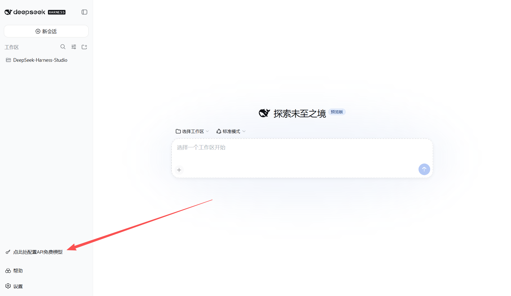
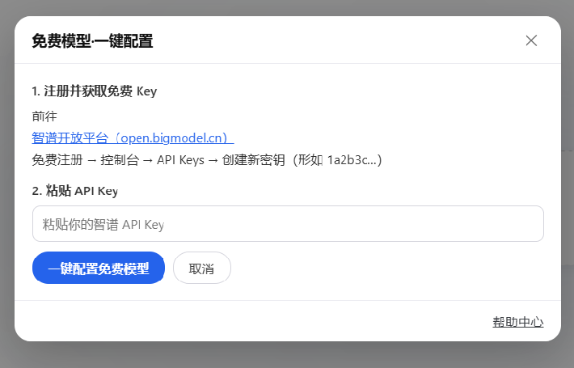
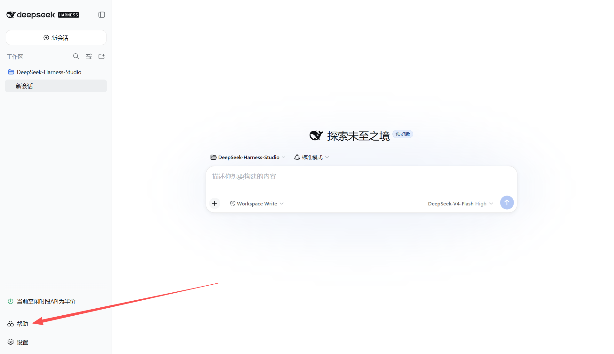
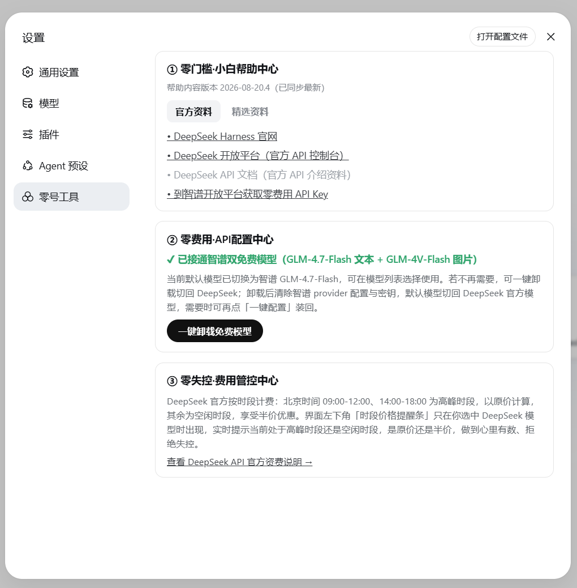
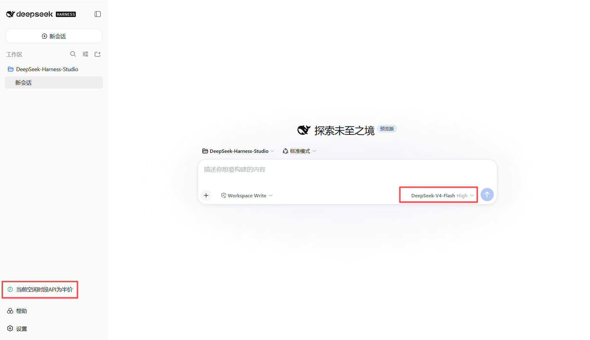

# dsh-0-tools 零号工具 / Zero Tools

**DeepSeek Harness 小白零门槛零费用套件 · A beginner-friendly, zero-cost toolkit for DeepSeek Harness (DSH)**

> 面向完全不懂 API / YAML / 环境变量的新手：**双击、粘贴、直接用**。
> For users who know nothing about API / YAML / env vars: double-click, paste, and go.

当前版本 Current version: **v1.3.2** · 兼容范围 Compatible: DSH `0.1.0-rc.7` ～ `0.1.1-rc.2`

## 功能一览 Features

| 位置 Position | 内容 Content | 说明 Description |
|------|------|------|
| 左下角（未配置时） | 蓝色按钮「点此处配置API免费模型」 | 智谱与 OpenRouter 均未接入时才显示，接入任一即自动隐藏；支持一键接入智谱双免费模型（文本 + 图片） |
| 左下角（选中 DeepSeek 系列大模型时） | 高峰 / 空闲计价提醒条 | 实时提示当前 DeepSeek 计费时段是API原价的高峰时段，还是API半价的空闲时段 |
| 左下角（常驻） | 「帮助」 | 包括「零门槛·小白帮助中心」的官方资料、精选资料等内容，在线更新、离线兜底 |
| 帮助中心精选资料（置顶） | 绿标 New「热门免费模型Ox-Alpha一键安装API Key」 | 粘贴 OpenRouter Key 一键接入当前热门免费大模型 Ox-Alpha（100万上下文、13.1万输出、图文输入），并自动设为默认模型 |
| 设置弹窗 | 「零号工具」页签 | ① 零门槛·小白帮助中心、② 零费用·API配置中心、③ 零失控·费用管控中心 |

## 截图 Screenshots



DSH 主界面，点击左下角"点此处配置API免费模型"



按提示步骤注册获取API免费模型，并复制粘贴API Key，再点"一键配置免费模型"



DSH 主界面，点击左下角"帮助"，将进入"零号工具"的帮助中心



"零号工具"的帮助中心分为三个部分：零门槛·小白帮助中心、零费用·API配置中心、零失控·费用管控中心



"零号工具"安装后，当你选择DeepSeek系列模型，将依据DeepSeek官方API调用计价高峰/空闲时段不同提示用户"当前高峰时段API为原价"或"当前空闲时段API为半价"

## 兼容性 Compatibility

本插件针对以下 DSH 版本开发与验证：

| DSH 版本 | 状态 Status |
|------|------|
| `0.1.0-rc.7` | 开发基线（`peerDependencies` 声明 `^0.1.0-rc.7`）Development baseline |
| `0.1.1-rc.2` | 已实测适配通过（页面加载 / 计价条 / 模型选择器 / 设置页签）Tested & verified |

> 安装前请确认 DSH 版本在 `0.1.0-rc.7` ～ `0.1.1-rc.2` 范围内（查看最新版本：`npm view @deepseek-ai/dsh versions`）。DSH 发布新大版本（如 `0.2.x`）后，请先查看本插件 Release 说明确认适配，再决定是否升级。

## 安装 Install

> 重要前提：本插件是 DSH 的插件，电脑上需要先有 DSH 本体，请先完成下面的「第一步」，再安装本插件。

### 第一步：先装好 DeepSeek Harness（DSH）

以下两种方式任选其一。

**方式 A：免安装直接运行（推荐新手，不用装任何东西）**

1. 按键盘 `Win + R`，在弹出的小窗口里输入 `cmd`，回车打开命令行。
2. 在黑色窗口里输入下面这行命令，回车：

   ```
   npx @deepseek-ai/dsh web
   ```

3. 等待片刻，浏览器打开 `http://127.0.0.1:3080`，能看到 DSH 网页界面就成功了。
4. 以后每次使用重复第 1、2 步即可（npx 按需下载，无需提前安装）。

**方式 B：全局安装（一次装好，以后命令更短）**

1. 同样按 `Win + R` 输入 `cmd` 回车。
2. 输入以下命令回车，等待安装完成（需要电脑已装 Node.js）：

   ```
   npm install -g @deepseek-ai/dsh
   ```

3. 安装完成后输入 `dsh web` 启动，浏览器打开 `http://127.0.0.1:3080` 即成功。

> 不确定有没有 Node.js？命令行输入 `node -v`，能显示版本号（如 v20.x）说明已装；提示"不是内部或外部命令"则需先安装 Node.js（官网 https://nodejs.org 下载 LTS 版安装包）。

### 方法一：一键安装（推荐，Windows）

> 请先完成上面的「第一步」安装 DSH，再继续。

1. 把本项目**下载并解压**到一个文件夹（路径最好全英文，如 `D:\dsh-0-tools`）。
2. 双击文件夹里的 **`install.bat`**。
3. 脚本会自动把插件安装进 DSH、启动 DSH，并自动打开网页 `http://127.0.0.1:3080`。
4. 看到左下角出现「帮助」和按钮，就安装成功了。

> 关于安全提示：install.bat 是纯文本脚本，可**右键 → 打开方式 → 记事本**查看全部内容后再运行（内容透明可审）。从网上下载的脚本没有数字签名，Windows 可能弹出 SmartScreen 警告（"Windows 已保护你的电脑"），点「更多信息 → 仍要运行」即可——这是 Windows 对无签名脚本的统一提示，不是病毒警告。

### 方法二：命令行安装（适合喜欢命令行的用户）

> 请先完成上面的「第一步」安装 DSH，并确保电脑已安装 Git（官网 https://git-scm.com 下载安装）。

1. 按 `Win + R`，输入 `cmd`，回车打开命令行。
2. 逐行复制下面每条命令，粘贴后按回车执行（每行单独回车）：

```bash
git clone https://github.com/ai-yukin/dsh-0-tools.git
cd dsh-0-tools
dsh plugin --profile web add "%cd%"
```

   每条命令的含义：
   - `git clone ...`：把本插件的代码下载到当前文件夹
   - `cd dsh-0-tools`：进入插件文件夹
   - `dsh plugin --profile web add "%cd%"`：把当前文件夹注册为 DSH 的插件

3. 完成后**重启 dsh web**（先关掉窗口，再重新 `dsh web`）生效。看到左下角出现「帮助」和按钮即安装成功。

## 目录结构 Structure

```
dsh-0-tools/
├── lib/
│   ├── index.js     # host 端：127.0.0.1:3090~3099 回环服务（/status /configure /uninstall）
│   └── client.js    # 浏览器端：左下角工具条 + 设置页签「零号工具」
├── cordis.patch.yml # web profile 注入声明
├── package.json
├── help.json        # 帮助中心在线数据源（托管于 GitHub Pages）
└── install.bat      # 一键安装 + 启动 + 验证
```

## 机制说明 How it works

- **配置状态判定**：host 端读 `~/.dsh/settings.yaml` 判断 `llm-pi-ai.providers.zai` 是否存在，作为权威来源；浏览器端每 5 秒轮询 `GET /status`。
- **一键配置**：`POST /configure` 写入 `ZAI_API_KEY` 凭据、`llm-pi-ai.providers.zai` provider 段，并把默认模型切到智谱 `glm-4.7-flash`。
- **一键卸载**：`POST /uninstall` 清除 zai provider 段与凭据，默认模型切回 DeepSeek 官方 `deepseek-official / deepseek-v4-flash`。
- **设置页签**：通过 `settings.section` slot 注入（官方插件同款机制），id `dsh-0-tools`，页签名「零号工具」。
- **帮助中心**：拉取 `https://ai-yukin.github.io/dsh-0-tools/help.json` 并比对版本，失败时回退内置数据，文案更新无需重装插件。

## 免责声明 Disclaimer

- 本插件为**第三方社区插件**，与 DeepSeek / 智谱官方无任何关联，官方不对其提供支持。
- 使用本插件接入第三方模型服务，请自行遵守对应平台的服务条款与费用政策。
- 本项目按 MIT 许可证开源，使用者需自行承担使用风险。
- 部分仓库内容（含本 README）由 AI 辅助生成，仅供参考。

## 许可证 License

[MIT](LICENSE) © 2026 ai-yukin
*（内容由AI生成，仅供参考）*
