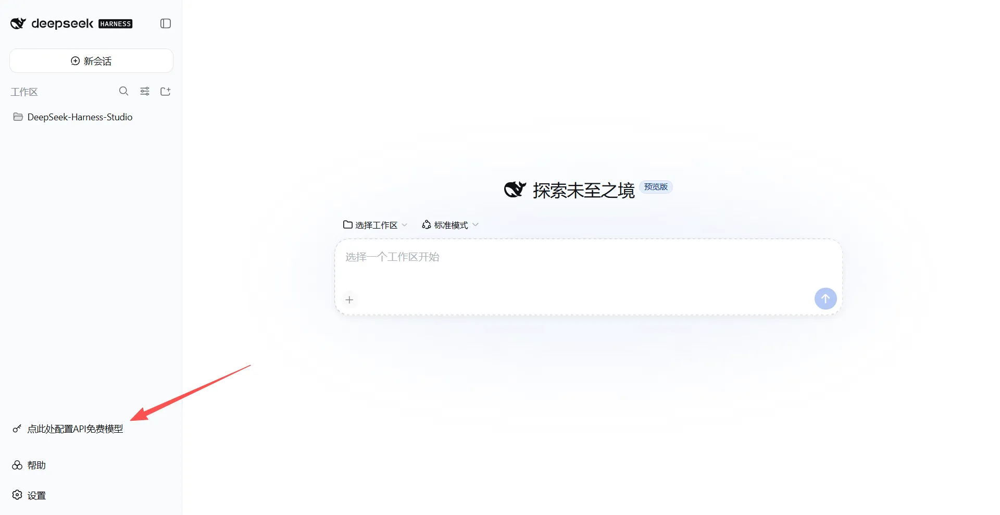
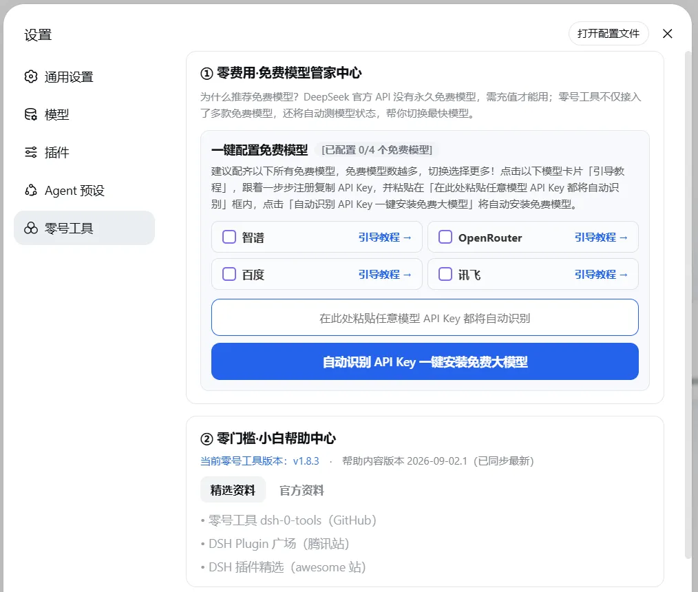
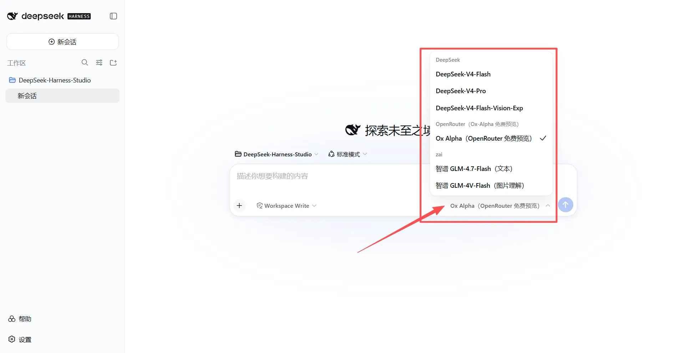

# dsh-0-tools 零号工具（No.0 Tools）

[简体中文](./README.md) · [English](./README.en.md)

## 零号工具是什么

零号工具是面向编程零基础的用户、初次使用 DeepSeek Harness（以下简称 DSH）场景而设计的工具，具有「零门槛、零费用、零失控、零困惑」的特性，希望帮助零基础用户获得更好的使用体验。

## 主要功能

1. **【零门槛】** 一键安装 DSH 及本工具，桌面自动生成快捷方式；
2. **【零费用】** 一键接入多款国内可访问的永久免费大模型（智谱 / 硅基流动 / 讯飞星火 / OpenRouter / ……），配置后在关键时刻自动测速、超时智能提示，且**不烧免费额度**；
3. **【零失控】** 若选择调用 DeepSeek 官方模型 API，将在 DSH 界面实时提示当前是高峰时段（原价）还是空闲时段（半价）；
4. **【零困惑】** 小白帮助中心汇总 DSH 官方资料与社区精选资源，新手快速上手。

## 当前版本与兼容范围

- 当前版本：**v1.10.1**
- 兼容 DSH 版本：**`0.1.5` ~ `0.1.x`**（已实测适配 `0.1.7-rc.2`）
  - ⚠️ **暂不支持 DSH `0.2.x`**。DSH `0.2.0` 起强制校验插件的 `peerDependencies` 版本范围，
    本插件依赖的 `@deepseek-ai/dsh-client-runtime` 在 `0.2` 中已不再提供，硬性排除 `0.2` 之前的版本。
    在 `0.2` 上安装会被 DSH 判定为不兼容而拒绝加载。适配 `0.2` 已在计划中。
  - 只想用最新 DSH 的用户，请先阅读下方「安装与使用」，注意版本匹配。
- **系统要求**：一键安装脚本支持 **Windows 10 / Windows 11**（`install.bat`）和 **macOS / Linux**（`install.sh`）；插件核心代码本身跨平台，已手动装好 DSH 的用户可通过 `dsh plugin --profile web add /path/to/dsh-0-tools` 手动安装。

## 免费模型清单

零号工具目前接入 4 款永久免费大模型，建议全部配齐——当某个模型繁忙或报错时，可有更多更快更稳定免费模型备选，实现"模型越多，可切换的选择越多"：

| 模型 | 提供方 | 特点 |
|------|--------|------|
| GLM-4.7-Flash + GLM-4V-Flash | 智谱 | 文本 + 图片理解，永久免费 |
| Qwen3-8B（15+款9B以下小模型） | 硅基流动 | 永久免费，国内直连，128K上下文，支持工具调用 |
| Spark Lite | 讯飞星火 | 永久免费，中文理解强 |
| OpenRouter 免费池 | OpenRouter | 自动路由数十款免费模型，某款下架自动绕开 |

> 每款模型均提供专属图文教程页，在"① 零费用·免费模型管家中心"点击「引导教程」即可查看手把手注册步骤。

## 安装与使用（图文步骤）

### 第 0 步：先获取源码（重要，别跳过）

`install.bat` / `install.sh` **不会自动下载任何东西** —— 它们只是把「脚本自己所在的这个文件夹」安装进 DSH。
所以在运行脚本之前，你必须先有完整的插件源码目录。

**推荐方式（拿最新版）**：

```bash
# 1. 克隆仓库（推荐，会自动拿到最新版本）
git clone https://github.com/ai-yukin/dsh-0-tools.git

# 2. 进入目录，确认能看到 lib/ 和 install.bat
cd dsh-0-tools
```

也可以在 GitHub 页面点 **Code → Download ZIP** 下载后解压。

> **国内网络访问 GitHub 不稳时**，可改用 Gitee 镜像（内容与 GitHub 同步）：
> ```bash
> git clone https://gitee.com/ai-yukin/dsh-0-tools.git
> ```

**判断你拿到的版本是不是最新**：打开目录下的 `package.json`，看 `"version"` 字段。
当前最新版本见本文开头的「当前版本与兼容范围」。

> ⚠️ **不要只单独下载 install.bat**。它依赖同目录下的 `lib/`、`cordis.patch.yml`、`help.json`
> 等文件才能工作，缺任一项都会安装失败。

### 第 1 步：运行一键安装脚本

- **Windows 用户**：双击运行 `install.bat`
- **macOS / Linux 用户**：在终端中运行 `chmod +x install.sh && ./install.sh`

#### Windows 版（install.bat）

- 电脑**已经装好 DSH**：脚本会自动检测并跳过安装，直接完成本工具的安装；
- 电脑**还没装 DSH**：脚本会自动扫描运行环境，补齐缺失的环境后自动安装 DSH；
- 安装成功后，脚本会自动在**桌面生成一个「DeepSeek Harness」快捷方式**。

> 小提示：`install.bat` 是纯文本脚本，可右键 →「打开方式 → 记事本」查看全部内容后再运行（内容透明可审）。从网上下载的脚本没有数字签名，Windows 可能弹出 SmartScreen 提示（"Windows 已保护你的电脑"），点「更多信息 → 仍要运行」即可——这是 Windows 对无签名脚本的统一提示，不是病毒警告。

### 第 2 步：打开 DSH 界面

双击桌面的「DeepSeek Harness」快捷方式，浏览器会自动打开 DSH 的网页界面。当你还没配置任何免费模型时，会自动弹窗引导配置；也可以在 DSH 界面左下角点击「配置免费模型」按钮，进入同款配置界面。



### 第 3 步：获取并安装 API Key

建议配齐以下所有免费模型，免费模型数越多，切换选择更多！点击以下模型卡片上的「引导教程」按钮，跟着一步步注册复制 API Key（讯飞需复制 APIKey 和 APISecret 两个值，用英文冒号拼接），并粘贴在「在此处粘贴任意模型 API Key 都将自动识别」框内，点击「自动识别 API Key 一键安装免费大模型」将自动安装免费模型。



> 已配置的模型会显示 ✅ 标记，并提供「一键卸载模型」（二次确认）；未配置的模型显示「引导教程 →」链接。

### 第 4 步：智能测速 + 超时提示，零费用更透明

配置好免费模型后，零号工具的「免费模型管家中心」会帮你挑出更快、更靠谱的可用模型：

- **省额度测速（v1.10 起改为触发式）**：只在关键时刻发一次 `max_tokens=1` 的极小请求测速——① 打开 DSH 时；② 空闲超过 30 分钟后你再次操作时；③ 你手动点「重新测速」时。**不再每分钟自动跑**，相比旧版可省约 99% 的免费模型额度消耗；
- **中位数判定**：记录最近 5 次响应时间，**去掉最高和最低值后取中位数**，避免偶发的一次卡顿把整体状态拖成「超时」；
- **状态判定**：中位数 < 8 秒 = 正常（🟢），8-15 秒 = 较慢（🟡），> 15 秒或超时 = 超时（🔴）；
- **智能推荐（不只看快慢）**：按「速度分 40% + 模型能力分 60%」算综合推荐分来推荐，避免推荐「快但笨」的模型；
- **超时提示**：当前模型超时时，侧边栏底部实时显示「智谱🔴超时，建议换讯飞」，状态条仅作提示，不可点击；
- **额度耗尽能直接识别**（v1.10 新增）：免费额度用完（HTTP 402）或 API Key 失效时，插件会**立即**把该模型标记为不可用并提示原因，不会再把「欠费」误报成「可用」；
- **可选自动切换**（v1.10 新增）：在设置页打开「自动切换」后，当前模型连续 2 次不可用时会自动切到综合推荐分最高的可用模型，并明确告知你切到了哪个；带 5 分钟冷却，不会来回跳。**默认关闭**，要不要交给它由你决定。




### 第 5 步：使用付费 DeepSeek 模型

如果你决定付费使用，并已申请、购买 DeepSeek 模型的 API，可在 DSH 界面左下角点「设置」，找到「模型」，在 DeepSeek 处点「编辑」，填入 DeepSeek 模型的 API 密钥。


### 第 6 步：DeepSeek 计费提醒

当你在 DSH 界面切换选择了 DeepSeek 官方模型，界面左下角会实时显示计价提醒，根据 DeepSeek 官方 API 调用的高峰/空闲时段，提示「当前高峰时段API为原价」或「当前空闲时段API为半价」，为你提供「零失控」的费用保驾护航。


> DeepSeek 官方计费规则（2026-08-23 起生效）：周末（周六/周日）全天统一低谷价，不再区分峰谷；仅工作日（周一至周五）执行峰谷分段计费——高峰时段（9:00-12:00、14:00-18:00）原价，其余空闲时段半价。

## 国内镜像下载地址

本仓库为中国大陆用户提供了 Gitee 镜像，现已开放：

- **GitHub 主仓库**：`https://github.com/ai-yukin/dsh-0-tools`
- **Gitee 镜像**：`https://gitee.com/ai-yukin/dsh-0-tools`

说明：

- 本仓库以 **GitHub 为主源仓库**，Gitee 为国内镜像。镜像由 GitHub Actions 自动同步（推送到 `main` 即触发），内容与主仓库保持一致；
- Gitee 现已统一使用 `main` 作为唯一分支，早期遗留的 `master` 分支已删除，因此首页展示的 README 就是最新版；
- 国内用户推荐从 Gitee 下载，访问速度更稳定；
- 如需反馈问题或建议，请在 GitHub 主仓库的 Issues 中提交。

> **获取源码的三种方式**（都拿到同一份最新版）：
> | 方式 | 命令 / 位置 | 适合 |
> |---|---|---|
> | Git 克隆 | `git clone https://github.com/ai-yukin/dsh-0-tools.git` | 想要后续能`git pull` 升级 |
> | Release 压缩包 | GitHub 仓库右侧 **Releases** → 下载 `dsh-0-tools-vX.Y.Z.zip` | 只想一次性安装，不想用 Git |
> | Gitee 镜像 | `git clone https://gitee.com/ai-yukin/dsh-0-tools.git` | 国内网络访问 GitHub 慢 |
>
> Release 压缩包由 GitHub Actions 在推送 `v*` 标签时自动生成，
> 内含顶层目录 `dsh-0-tools-vX.Y.Z/`，**解压后在解压出的目录里**运行安装脚本即可。

## 兼容性

本插件针对以下 DSH 版本开发与验证：

| DSH 版本 | 状态 |
|------|------|
| `0.1.7-rc.2` | 已实测适配通过（页面加载 / 计价条 / 模型选择器 / 设置页签 / 官方配置通道 / web 认证机制） |
| `0.1.1-rc.2` | 已实测适配通过（页面加载 / 计价条 / 模型选择器 / 设置页签 / 官方配置通道） |


## 目录结构

```
dsh-0-tools/
├── lib/
│   ├── index.js     # host 端：本地测速代理服务器（127.0.0.1:3095），绕过浏览器CORS
│   └── client.js    # 浏览器端：左下角工具条 + 设置页签「零号工具」+ 经官方 /api 读写配置
├── guide/                # v1.8.0 新增：4 款免费模型专属图文教程页
│   ├── zai.html              # 智谱教程
│   ├── openrouter-free.html  # OpenRouter 教程
│   ├── siliconflow.html       # 硅基流动教程
│   ├── xinghuo.html          # 讯飞星火教程
│   └── images/               # 教程截图
├── screenshots/           # README 用截图
├── cordis.patch.yml       # web profile 注入声明
├── package.json
├── help.json              # 帮助中心在线数据源（托管于 GitHub Pages，支持远程热更新模型清单）
├── install.bat            # Windows 一键安装 + 启动 + 验证
├── install.sh             # macOS / Linux 一键安装 + 启动 + 验证
├── .github/workflows/     # CI：Gitee 镜像同步 + Release 自动打包
├── VERSION_UPDATE_CHECKLIST.md  # 发版检查清单（版本号同步点、回归项）
├── CONTRIBUTING.md
└── LICENSE
```

> 打 zip 发 Release 时会包含 `lib/`、`guide/`、`screenshots/`、`cordis.patch.yml`、`package.json`、`help.json`、安装脚本与 README。
> `.github/`、`article/`、`draft_*/`、调试残留文件不打包。

## 机制说明


- **配置状态判定**：浏览器端调用官方 `settings.describe` + `credentials.describe`，判断 `llm-pi-ai.providers.{provider}` 是否存在及其凭据是否已配置，作为权威来源；每 5 秒轮询一次刷新界面。凭据服务临时不可用时状态判为「未知」而非「已配置」，避免界面误报全绿（v1.10 修复）。
- **一键配置**：依次经官方 `credentials.set` 写入凭据、`settings.mutate` 写入 provider 配置段、`settings.update` 以合并语义把默认模型切换到对应免费模型（合并语义确保 `reasoningEffort` 等用户已设字段不被抹掉）。
- **一键卸载**：经官方通道清除 provider 配置段与对应凭据；仅当默认模型此前指向该 provider 时，恢复为配置前记录的原始默认模型，否则保持用户当前选择不变。
- **API Key 自动识别**：根据 Key 前缀/格式自动识别属于哪个模型（`sk-or-v1-` → OpenRouter，`sk-`（非sk-or-v1-）→ 硅基流动，`APIKey:APISecret` 格式或 32 位 hex → 讯飞星火，带点号的长字符串 → 智谱），识别后自动调用一键配置流程。
- **免费模型管家中心（触发式测速）**：仅在「打开 DSH / 空闲 30 分钟后恢复操作 / 手动点重新测速」三个时机各测速一轮，不再后台每 60 秒持续测速，节省约 99% 免费额度。记录最近 5 次响应时间，**去掉最高最低值后取中位数**作为判定依据；单次测速超时 15 秒。
- **测速错误分类**：Host 端按 HTTP 状态码 + 响应体特征分类为 `quota_exhausted`（402 / 余额不足 / 额度用尽）、`auth_failed`（401/403）、`rate_limited`（429）、`model_unavailable`（404）、`server_error`（5xx）、`timeout`。其中**确定性失败（额度耗尽 / 认证失败 / 模型不可用）立即标记不可用**，不再空跑两次重试（v1.10 修复，旧版把 402 归入 unknown 会误报「可用」）。
- **智能推荐与自动切换**：综合推荐分 = 速度分 × 40% + 能力分 × 60%（能力分可由远程 `help.json` 的 `capabilityScore` 覆盖）。自动切换为**默认关闭**的可选功能，开启后当前模型连续 2 次不可用才切到推荐分最高的可用模型，带 5 分钟冷却并明确通知用户。
- **失效残留清理**：配置中心检测本地是否残留已下线/失效的模型 provider（动态读取其 `apiKeyEnv`，不再依赖本地静态清单），在界面给出「失效残留」提示并提供一键清理，避免孤儿配置无法删除。
- **设置页签**：通过 `settings.section` 插槽注入（官方插件同款机制），id 为 `dsh-0-tools`，页签名「零号工具」。
- **帮助中心**：拉取 `https://ai-yukin.github.io/dsh-0-tools/help.json`，经统一过滤器 `filterRemotePayload` 逐字段安检（URL 强制 https、文本拒绝控制字符/换行、模型 id 与凭据名走字符白名单）后再进入界面与配置链，失败或不合规时回退内置数据；可配置模型清单与已下线模型清单均由此远程数据驱动，新增或下线模型无需重装插件。
- **教程页托管**：教程页统一托管于 GitHub Pages（`https://ai-yukin.github.io/dsh-0-tools/guide/`），国内用户可通过 Gitee 镜像仓库下载源码后本地查看教程。

## 免责声明

- 本插件为**第三方社区插件**，与 DeepSeek、智谱、硅基流动、讯飞、OpenRouter 官方均无任何关联，官方不对其提供支持。
- 使用本插件接入第三方模型服务，请自行遵守对应平台的服务条款与费用政策。
- 免费模型通道的对话内容可能被模型厂商留存用于训练，请勿在此通道输入商业机密、个人隐私等敏感内容。
- 本项目按 MIT 许可证开源，使用者需自行承担使用风险。

## 许可证

[MIT](LICENSE) © 2026 ai-yukin
